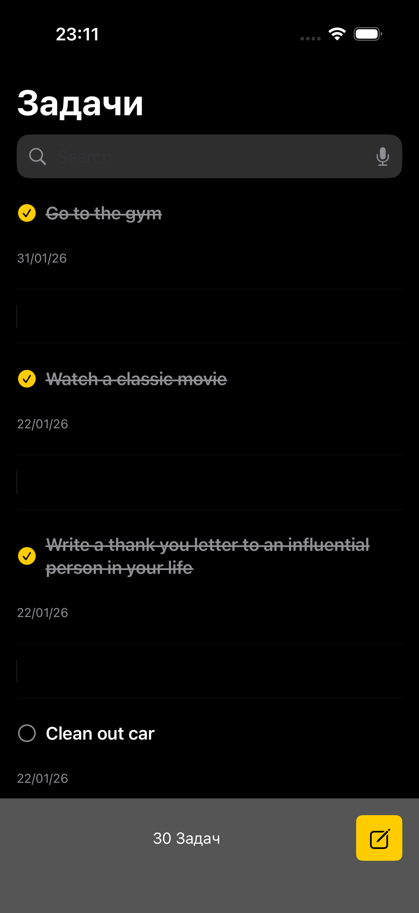
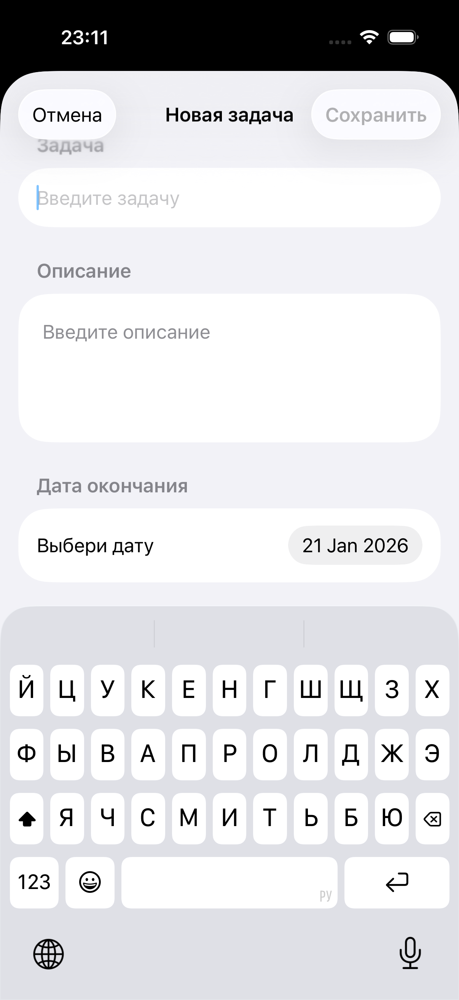
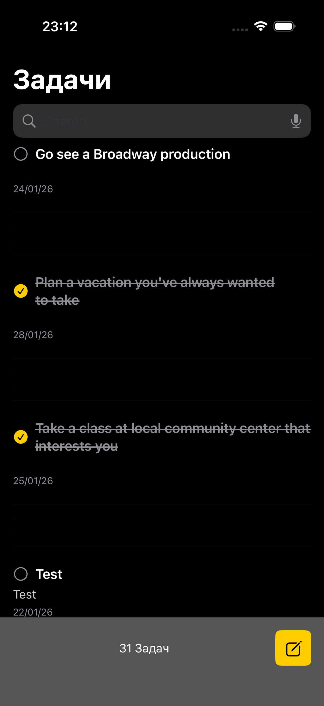
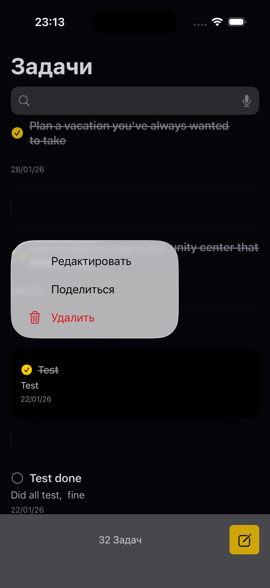

# ToDoList App 📝

A full-featured iOS task management application built with Swift and UIKit. The app allows you to create, edit, track, and manage your daily tasks efficiently.

## Features
- **Create Tasks**: Add new tasks with title and description
- **Edit Tasks**: Modify existing tasks
- **Date Selection**: Set deadlines for your tasks
- **Mark as Complete**: Check off tasks as completed with a single tap
- **Task Status**: View completion status of each task

## Screenshots 
<p align="center">
  
  
  
  
</p>

## Key Functionality

### Task Management
- **Add**: Create new tasks with detailed descriptions
- **View**: See all tasks with their current status
- **Edit**: Update task information
- **Delete**: Remove unnecessary tasks
- **Complete**: Mark tasks with a checkmark as completed

### Date Management
- Select task completion dates
- Track deadlines
- Sort tasks by date

### JSON Integration
- Load tasks from JSON API
- Data synchronization
- Parse and display external data

### Architecture
- **Pattern**: MVC (Model-View-Controller)
- **UI Framework**: UIKit
- **Data Persistence**: UserDefaults / CoreData
- **Networking**: URLSession for JSON
- **Testing**: XCTest

### Technologies Used
- Swift
- UIKit
- Foundation
- URLSession
- Codable Protocol
- Date Picker
- Table View
- Unit Testing
- UI Testing

### Requirements
- iOS 13.0+
- Xcode 12.0+
- Swift 5.0+

## Installation

1. Clone the repository:
```bash
git clone https://github.com/Jigitekov/ToDoListApp.git
```

2. Open the project in Xcode:
```bash
cd ToDoListApp
open ToDoList\(EffectiveMobile\).xcodeproj
```

3. Build and run the project on your simulator or device

## Project Structure

```
ToDoListApp/
├── ToDoList(EffectiveMobile)/
│   ├── Models/              # Data models
│   ├── Views/               # UI components
│   ├── Controllers/         # View Controllers
│   ├── Services/            # Services (Network, Storage)
│   ├── Resources/           # Assets, Storyboards
│   └── Supporting Files/    # AppDelegate, SceneDelegate
├── ToDoList(EffectiveMobile)Tests/
│   └── Unit Tests/          # Unit tests
└── ToDoList(EffectiveMobile)UITests/
    └── UI Tests/            # UI tests
```

## Usage

### Creating a New Task

1. Tap the "+" button to add a task
2. Enter the task title and description
3. Select a completion date (optional)
4. Tap "Save"

### Editing a Task

1. Tap on a task in the list
2. Modify the required fields
3. Save changes

### Marking as Complete

1. Find the task in the list
2. Tap the checkbox next to the task
3. The task will be marked as completed

### Loading Tasks from JSON

The app automatically loads tasks from a JSON source on launch. JSON format:

```json
{
  "todos": [
    {
      "id": 1,
      "title": "Task Title",
      "description": "Task Description",
      "date": "2025-01-21",
      "completed": false
    }
  ]
}
```
